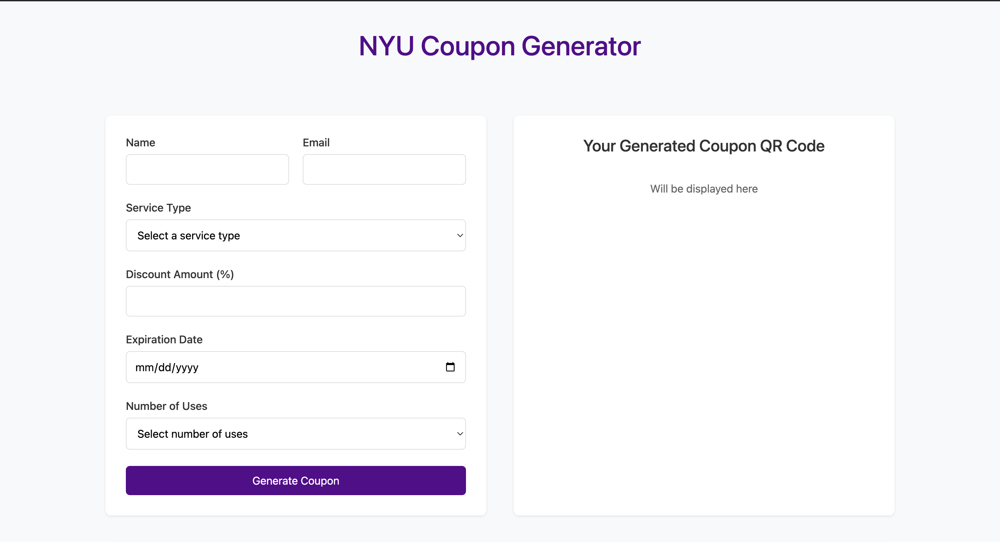
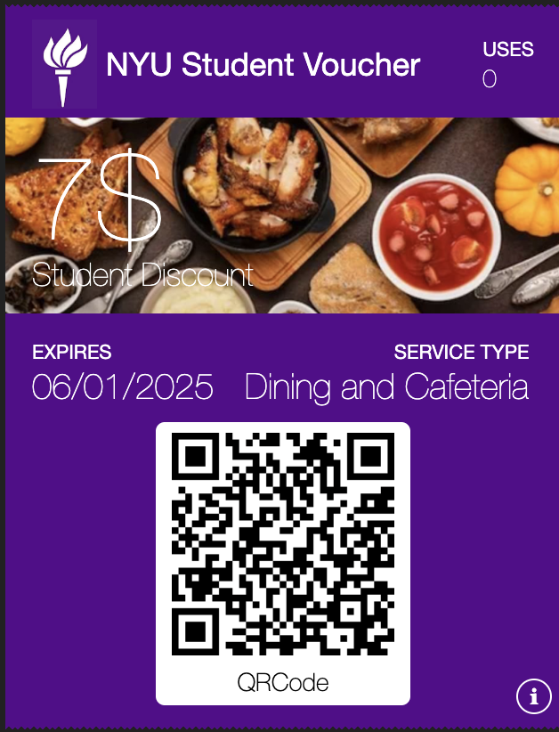
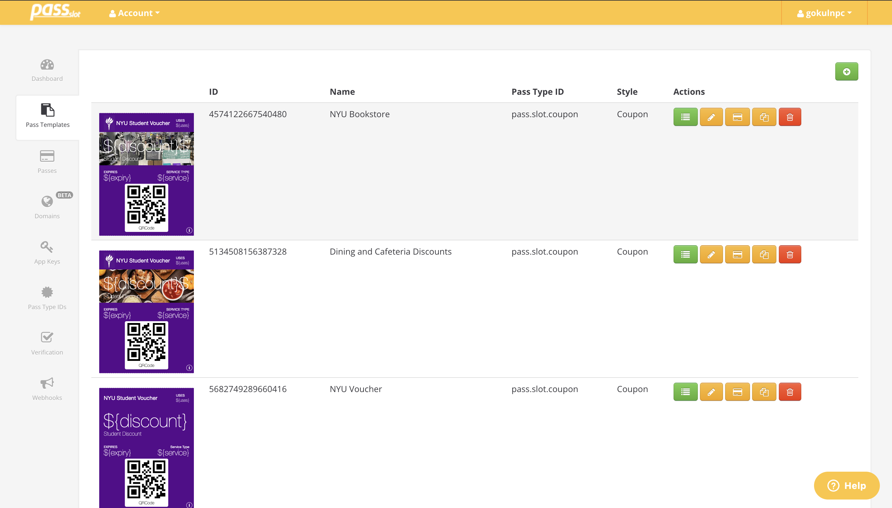
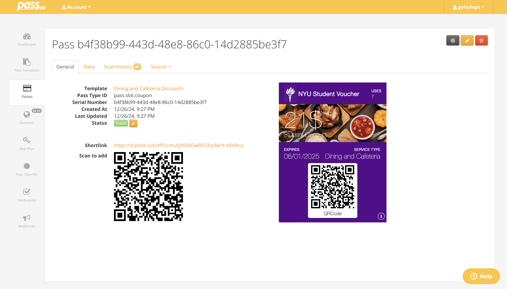

# NYU Digital Coupon Generator 🎫

A serverless digital coupon management system that seamlessly integrates with Apple Wallet, designed specifically for NYU's campus services.






## 🚀 Features

### Digital Coupon Creation

- 💰 Flexible discount configuration (0-100% off)
- 🏪 Multiple service type support (Bookstore, Dining, etc.)
- 🔄 Customizable usage limits (1-10 uses or unlimited)
- ⏰ Automated expiration date management
- 📱 Real-time QR code generation
- 🎟️ Instant digital pass creation

### Distribution System

- 📲 Direct integration with Apple Wallet
- 📨 Multi-channel distribution (email and SMS)
- ⚡ Instant QR code generation and delivery
- 🔌 Seamless pass installation process
- 🌐 Cross-platform compatibility

### Management Dashboard

- 📊 Real-time coupon tracking
- 📈 Comprehensive usage analytics
- 🔄 Automated status updates
- 📝 Complete audit trail
- 👥 Staff authorization management
- ✅ Instant validation system

## 🔒 Security Features

- 🔐 Role-based access control
- ⚡ Real-time validation checks
- ⏱️ Automated expiration enforcement
- 🛡️ Anti-fraud protection measures
- 🗄️ Secure database management
- 📋 Audit logging capabilities

## 🛠️ Technical Requirements

- Google Workspace account
- PassSlot API access
- QR code scanning capability

## 🚀 Getting Started

### Prerequisites

```bash
# Clone the repository
git clone https://github.com/gokulnpc/NYU-Coupon-Generator.git

```

### Configuration

1. Add your API keys and configuration:

```
const SHEET_NAME = "";
const PASSSLOT_API_KEY = "";
const TWILIO_SID = "";
const TWILIO_SECRET = "";
```

## 📖 Documentation

- [API Documentation](https://www.passslot.com/developer/api/resources)

## 🔄 Workflow

1. Staff creates coupon with specified parameters
2. System generates unique QR code and digital pass
3. Distribution via email or SMS
4. Student adds pass to Apple Wallet
5. Staff scans QR code at redemption
6. System validates and updates usage

## 📄 License

This project is licensed under the MIT License - see the [LICENSE](LICENSE) file for details.

---

Made with ❤️ for NYU
